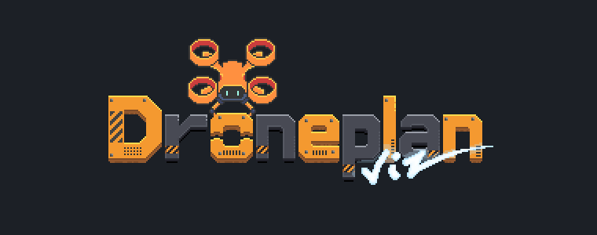
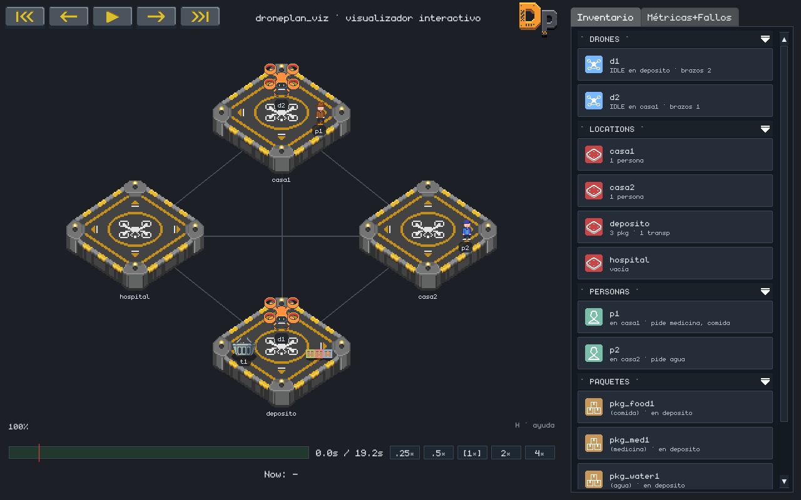
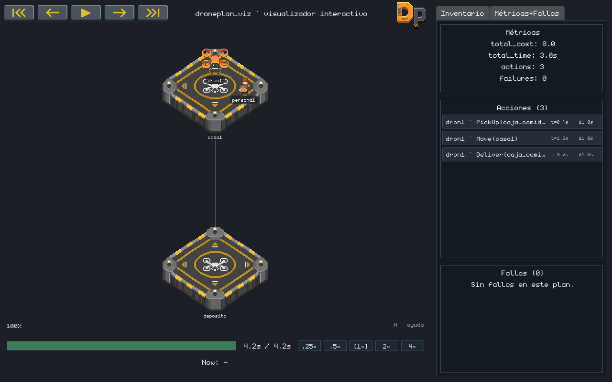
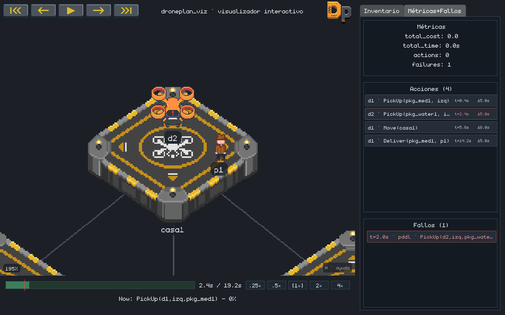

<div align="center">



### Biblioteca de visualización y validación lógica de planes en dominios de drones

*Simula, anima y valida planes de planificación automática (PDDL) sin salir de Python.*

[](https://www.python.org/)
[](https://pyga.me/)
[](#pruebas)
[](LICENSE)
[](#)

</div>

---

## ¿Qué es droneplan_viz?

**droneplan_viz** es una biblioteca de Python que convierte los planes de la
planificación automática —normalmente un fichero de texto difícil de leer— en
una **animación clara y verificable**. Está pensada como herramienta docente
para un dominio logístico de drones: drones que recogen, transportan y entregan
paquetes, con brazos manipuladores y transportadores auxiliares.

La biblioteca no se limita a dibujar: **valida la lógica** de cada acción antes
de representarla. Si un plan intenta algo físicamente imposible (recoger un
paquete que no está donde el dron, exceder la capacidad de un transportador…),
la simulación lo detecta y lo señala visualmente, sin necesidad de un
planificador externo.

<div align="center">

<br/>
<em>Vista general: la escena isométrica, el HUD con la telemetría de cada agente y el panel de inventario.</em>
</div>

---

## Características

- **Reproducción de planes secuenciales y temporales.** Soporta tanto planes
  clásicos (STRIPS) como planes temporales de PDDL 2.1, con acciones durativas
  y concurrentes.
- **Validación lógica integrada.** Un validador central y una máquina de estados
  por dron comprueban cada acción: disponibilidad de brazos, capacidad de los
  transportadores y que los objetos estén en el mismo lugar.
- **Detección visual de errores.** Un plan inconsistente lleva al dron a un
  estado de ERROR, resaltado en la escena y en el panel de fallos.
- **API sencilla y bilingüe.** Constructores encadenables para montar el mundo
  y el plan paso a paso, con métodos en español e inglés.
- **Aplicación interactiva.** Reproducción con controles de tiempo, zoom y
  desplazamiento de cámara, panel de métricas, avance fotograma a fotograma,
  capturas de pantalla y panel de ayuda.
- **Determinista y probada.** Comportamiento reproducible entre ejecuciones,
  respaldado por cerca de **1920 pruebas automatizadas**.

---

## Instalación

> Requisitos: **Python 3.12 o 3.13**.

```bash
# Clonar el repositorio
git clone [https://github.com/](https://github.com/)<tu-usuario>/droneplan_viz.git
cd droneplan_viz

# (Recomendado) crear un entorno virtual
python -m venv .venv
source .venv/bin/activate        # En Windows: .venv\Scripts\activate

# 1. Instalación estándar (uso normal de la aplicación)
pip install ".[app]"

# 2. Instalación para desarrollo (modificar código y tests)
pip install -e ".[app,dev]"
```

---

## Uso básico

Montar un mundo, escribir un plan y verlo simulado son unas pocas líneas:

```python
from droneplan_viz import DronePlanViz

viz = DronePlanViz()

# 1) Construir el mundo
viz.world.location("deposito")
viz.world.location("casa1")
viz.world.costes({("deposito", "casa1"): 8}, simetrico=True)
viz.world.content("comida")
viz.world.person("persona1", at="casa1", necesita=["comida"])
viz.world.package("caja_comida", contiene="comida", at="deposito")
viz.agents.drone("dron1", at="deposito")

# 2) Escribir el plan (traducción directa de las acciones)
viz.recoger("dron1", caja="caja_comida", brazo="izq")
viz.mover("dron1", a="casa1")
viz.entregar("dron1", caja="caja_comida", a="persona1")

# 3) Validar sin abrir ventana...
resultado = viz.simular()
print(resultado.succeeded, resultado.makespan, len(resultado.failures))

# 4) ...o abrir la aplicación interactiva
viz.run()
```

En la carpeta [`examples/`](examples/) hay ejemplos completos y comentados,
desde los más simples hasta escenarios con transportadores, concurrencia y
casos de fallo.

---

## La interfaz

<table>
<tr>
<td width="50%">

<br/>
<em>Panel de métricas y lista de acciones de un plan que se ejecuta sin incidencias.</em>
</td>
<td width="50%">

<br/>
<em>Un dron viola una precondición: pasa a ERROR, con la acción fallida resaltada y su entrada en el panel de fallos.</em>
</td>
</tr>
</table>

### Controles

| Tecla / acción            | Función                                        |
|---------------------------|------------------------------------------------|
| `Espacio`                 | Reproducir / pausar                            |
| `←` / `→`                 | Acción anterior / siguiente                    |
| `,` / `.`                 | Fotograma a fotograma (mantener para continuo) |
| `Inicio` / `Fin`          | Ir al principio / final del plan               |
| Rueda del ratón, `+` / `−`| Acercar / alejar la cámara                     |
| `0`                       | Restablecer la cámara                          |
| Arrastrar (botón central) | Desplazar la vista                             |
| `L`                       | Mostrar / ocultar las etiquetas                |
| `F` / `Mayús`+`F`         | Captura de la ventana / solo del visor         |
| `H`                       | Mostrar / ocultar la ayuda                     |

---

## Estructura del proyecto

```
droneplan_viz/
├── droneplan_viz/          # La biblioteca (dominio, motor, render, fachada)
│   ├── domain/             # Entidades del mundo y reglas de validación
│   ├── commands/           # Acciones como datos (patrón Command)
│   ├── runtime/            # Motor de ejecución y validación de planes
│   ├── history/            # Historial de estados de la simulación
│   ├── render/             # Dibujado de la escena y las animaciones
│   └── facade/             # API pública de alto nivel
├── droneplan_viz_app/      # La aplicación interactiva (HUD, controles)
├── examples/               # Ejemplos de uso, de simple a avanzado
└── tests/                  # Suite de pruebas automatizadas
```

---

## Pruebas

El proyecto se apoya en cerca de **1920 pruebas automatizadas** que cubren el
dominio, el motor de ejecución, el renderizado y la aplicación.

```bash
pytest
```

---

## Créditos

Todos los elementos gráficos en pixel art (sprites y logotipo) se dibujaron a
mano con [Krita](https://krita.org/). El sprite del dron se realizó tomando como
referencia una ilustración de un cuadricóptero en pixel art de
[Vecteezy](https://www.vecteezy.com/), y las paletas de color se seleccionaron
a partir de [Color Hunt](https://colorhunt.co/).

Desarrollado como Trabajo de Fin de Grado en Ingeniería Informática
(Universidad de Alcalá).

---

## Licencia

Distribuido bajo la licencia MIT. Consulta el archivo [`LICENSE`](LICENSE) para
más información.
